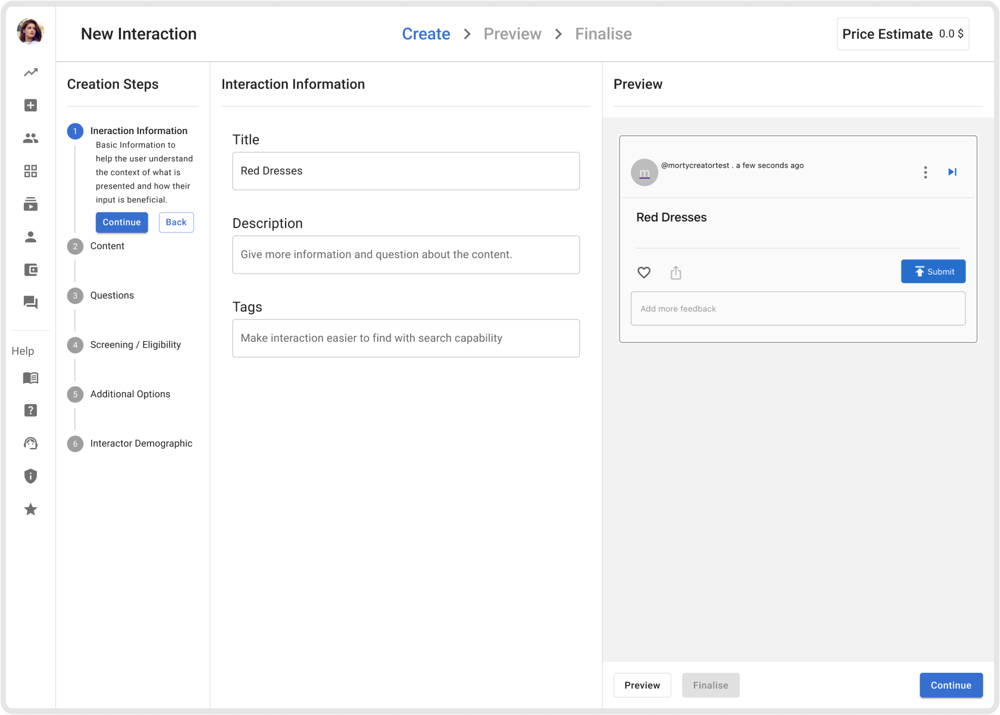
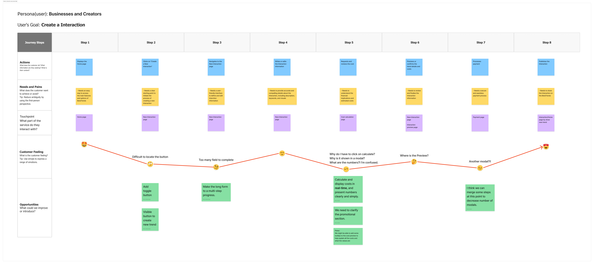
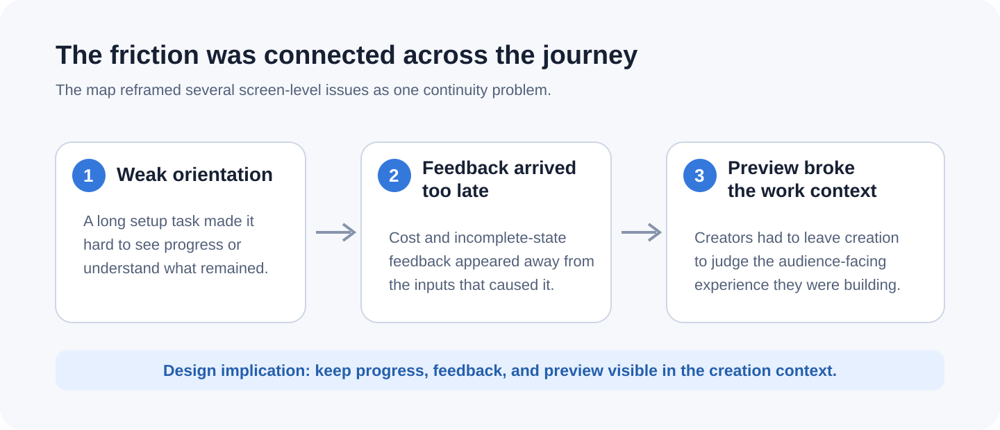
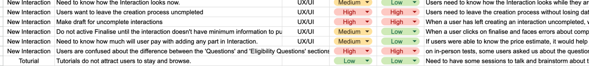
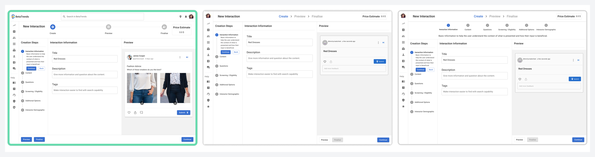
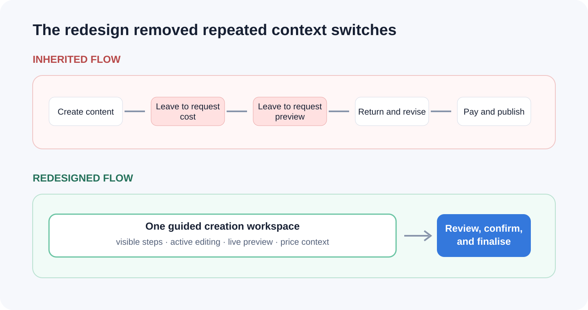

# The BetaTrends redesign reduced Interaction-creation time by 47%

## Redesigning BetaTrends’ New Interaction flow

BetaTrends was a market-research platform. Businesses used it to create an “Interaction” and ask a target audience for feedback. Creating one involved a lot: content, questions, screening rules, demographics, pricing, preview, payment, and publishing.

I worked on redesigning this flow. I mapped the journey, reviewed Hotjar recordings, created three design options, ran workshops, built prototypes, and tested the design in Maze. I also prepared the final designs for developer handoff.

<video controls muted loop playsinline preload="metadata" poster="images/hero-selected-workspace.png" width="100%">
  <source src="images/hero-workspace-loop.webm" type="video/webm">
  <source src="images/hero-workspace-loop.mp4" type="video/mp4">
  <a href="images/hero-workspace-loop.mp4">Watch a short demonstration of the selected workspace direction</a>.
</video>

*This short video shows how preview and price information became part of the released workspace.*

| Project detail | Scope |
|---|---|
| **Role** | Product Designer |
| **Period** | 2023–2024 |
| **Primary collaborator** | Pieter, founder and product owner, who also worked in engineering |
| **My contribution** | Journey map, flow design, Hotjar review, concepts, workshops, prototype, Maze tests, iteration, and handoff |
| **Status** | Released redesign; usability testing showed a 47% reduction in completion time |

## First, what is an Interaction?

An Interaction was something like a social-media post, but it was made for market research. A creator added the content, questions, and target audience. An “interactor” responded to it, and the creator received feedback about their product or idea.

This is why the creation flow mattered. What creators entered here became the experience their audience would see.

<video controls muted playsinline preload="metadata" poster="images/03-audience-interaction-poster.jpg" width="100%">
  <source src="images/03-audience-interaction.mp4" type="video/mp4">
  <a href="images/03-audience-interaction.mp4">Watch the audience-side Interaction prototype</a>.
</video>

*This audience-side prototype shows what someone would see after a creator set up and published an Interaction.*

## The problem was bigger than one screen

The existing design had problems across the whole journey. Creators had to find where to start, complete a long form, request a cost calculation, find the preview, move through several modals, pay, and publish.

To understand the problem better, I helped create an eight-step journey map. We put every part of the experience in one place and walked through it from the creator’s point of view. Three connected problems stood out:

- creators could not easily see where they were in a long task;
- cost and incomplete-work feedback appeared too late;
- preview was separate from creation, so creators had to leave their work to check the result.

*The map changed the conversation. Instead of treating the long form, price, and preview as separate problems, we could see that creators were losing context throughout the same journey.*

*The answer was not only to shorten the form. Creators also needed to see their progress, feedback, and preview while they were working.*

### A long form obscured progress

<video controls muted playsinline preload="metadata" width="100%">
  <source src="images/05-old-long-form.mp4" type="video/mp4">
  <a href="images/05-old-long-form.mp4">Watch the inherited long-form flow</a>.
</video>

### Modal interruptions broke continuity

<video controls muted playsinline preload="metadata" width="100%">
  <source src="images/06-old-modal-flow.mp4" type="video/mp4">
  <a href="images/06-old-modal-flow.mp4">Watch the inherited modal flow</a>.
</video>

*The old design put most of the work on one long page, then interrupted the flow with separate modals.*

## Hotjar helped me find where people were getting stuck

Before the first limited launch, I recommended using a user-insight tool to understand how people behaved in the product. We chose Hotjar, and I reviewed recordings for the `/newTrend` page.

The recordings showed where people slowed down or became confused. Managing questions took a lot of time, the difference between question types was unclear, and important information such as price and incomplete steps appeared too late. I collected these problems in one list and used it to discuss priorities with the team.

This gave the next design pass a clear focus: keep progress visible, show feedback beside the related input, and let creators check the Interaction without leaving their work.

*This problem list became a practical bridge between watching the recordings and deciding what we should improve next.*

## I created three options so we could compare the ideas

I ran workshops where people shared their ideas and concerns about the problems we found. I reviewed their feedback and used the useful parts to improve the designs. I worked most closely with Pieter, the founder and product owner.

I then created and presented three options. Pieter and I reviewed them together, comparing where to show the steps, how much space to give the preview, where price information should appear, and how to separate different question types.

*From left to right: options A, B, and C. Pieter and I chose the direction that kept the steps, editing area, and preview visible together, because it gave creators the clearest view of their work.*

## The first redesign added structure, but it was not enough

In the first redesign, I changed the long form into visible stages. We were already using MUI across design and development, so I kept working with that system to help the team move faster.

<video controls muted playsinline preload="metadata" poster="images/08-first-redesign-poster.jpg" width="100%">
  <source src="images/08-first-redesign.mp4" type="video/mp4">
  <a href="images/08-first-redesign.mp4">Watch the first staged redesign</a>.
</video>

*The steps were easier to see, but preview and feedback still felt separate from the main work.*

## The selected direction brought the work and preview together

For the next direction, I organised the page into three areas: the creation steps, the section being edited, and the audience preview. I also brought the price estimate into the same page and separated standard questions from screening and eligibility questions.

*Creators could now check the result and the current state without leaving the creation flow.*

<video controls muted playsinline preload="metadata" poster="images/10-selected-direction-poster.jpg" width="100%">
  <source src="images/10-selected-direction.mp4" type="video/mp4">
  <a href="images/10-selected-direction.mp4">Watch the selected direction and its key changes</a>.
</video>

*This walkthrough shows the expandable sidebar, steps on the left, real-time preview, price estimate, and separate question types.*

## Testing showed that three problems were still there

Before handing the design to developers, I built an interactive prototype and ran a usability test in Maze. The test showed three problems that needed another design pass:

1. People could reach finalisation before learning that another section was incomplete.
2. Navigating, editing, and adding questions remained difficult.
3. Similar button treatments contributed to wrong clicks.

These findings gave me a clear direction for one more design pass.

- [Watch part of the Maze usability test](https://youtu.be/2YnG8aUv2Sc)
- [Watch the Maze summary report](https://youtu.be/L126ayjPpTY)
- [Watch the usability-breakdown report](https://youtu.be/1wI-G4FqsEw)

<iframe width="100%" height="480" src="https://www.youtube.com/embed/2YnG8aUv2Sc" title="Maze usability-test excerpt for the New Interaction prototype" loading="lazy" allow="accelerometer; clipboard-write; encrypted-media; gyroscope; picture-in-picture" allowfullscreen></iframe>

*The test clip is the main evidence here. The summary and usability-breakdown recordings provide more detail.*

## I turned each finding into a specific change

### Incomplete work became visible before finalisation

I added clearer icons, labels, and states for incomplete steps. Creators could see what was missing while moving through the flow instead of finding out only at the end.

<iframe width="100%" height="480" src="https://www.youtube.com/embed/_TbcaEaELtI" title="Prototype showing incomplete-step feedback before finalisation" loading="lazy" allow="accelerometer; clipboard-write; encrypted-media; gyroscope; picture-in-picture" allowfullscreen></iframe>

[Open the incomplete-step feedback video](https://youtu.be/_TbcaEaELtI).

*Because missing work appeared too late, I made incomplete steps visible throughout the flow.*

### Larger question sets became easier to scan and rearrange

I changed the questions into accordions and added reordering. This showed less information at once, while keeping every question available to edit.

<iframe width="100%" height="480" src="https://www.youtube.com/embed/NIMnuTMMQV8" title="Prototype showing accordion question management and reordering" loading="lazy" allow="accelerometer; clipboard-write; encrypted-media; gyroscope; picture-in-picture" allowfullscreen></iframe>

[Open the question-management video](https://youtu.be/NIMnuTMMQV8).

*Because larger question sets were difficult to manage, I made them easier to scan, open, and rearrange.*

### The expected next action became more distinct

I made Continue more distinct from Back and reconsidered where preview and finalisation should appear. This made the expected next action clearer.

<iframe width="100%" height="480" src="https://www.youtube.com/embed/qQh1Kg8P5ng" title="Prototype showing revised action hierarchy and finalisation path" loading="lazy" allow="accelerometer; clipboard-write; encrypted-media; gyroscope; picture-in-picture" allowfullscreen></iframe>

[Open the CTA and finalisation video](https://youtu.be/qQh1Kg8P5ng).

*Because similar buttons caused wrong clicks, I made the main action and finalisation path more distinct.*

## We released the redesign after testing showed a 47% reduction in completion time

The final design covered Interaction Information, Content, Questions, Screening and Eligibility, Additional Options, Interactor Demographics, preview, step states, and related interaction variations. I prepared the designs and supporting material for the developers, and the redesigned flow was released.

<iframe width="100%" height="480" src="https://www.youtube.com/embed/pijP1Bi8gjc" title="End-to-end walkthrough of the final New Interaction design" loading="lazy" allow="accelerometer; clipboard-write; encrypted-media; gyroscope; picture-in-picture" allowfullscreen></iframe>

[Open the final-flow walkthrough](https://youtu.be/pijP1Bi8gjc).

*This walkthrough shows the final design that was prepared for development and released.*

In the usability test I conducted, completion time decreased by 47%. The result supported the direction we had taken: breaking the work into visible steps and keeping the important information together helped people move through the flow faster.

## What I learned

This project changed how I think about making a complicated product simpler. Removing steps is not always the answer. Sometimes people need to see the structure, what depends on what, and where they are in the process.

For future projects, I would set up the measurement plan earlier and keep the original usability-test exports together with the design files. This would make it easier to connect each change to completion, errors, and drop-off later.
