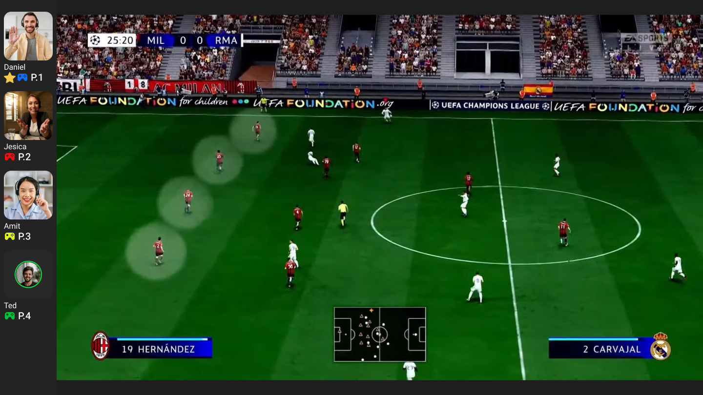
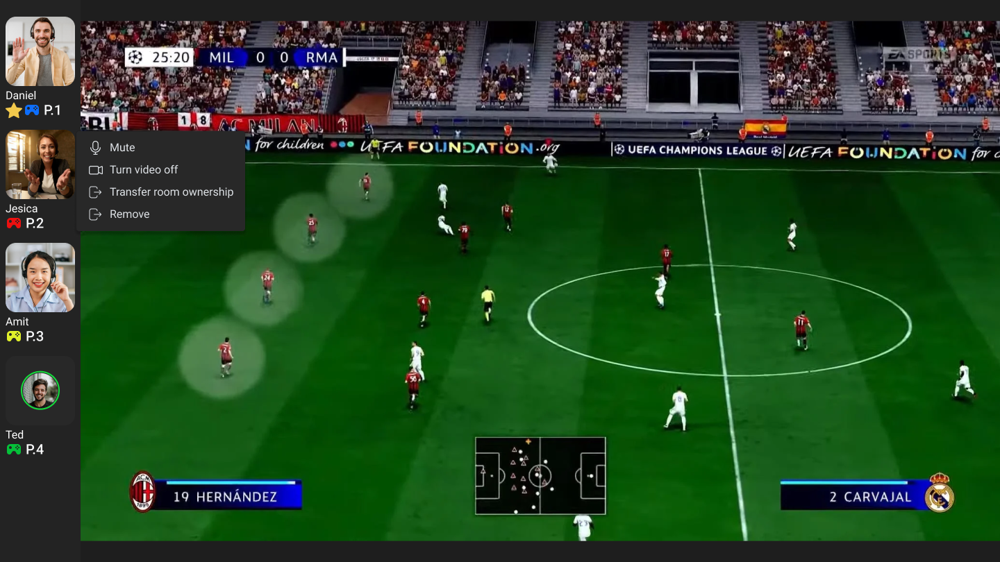
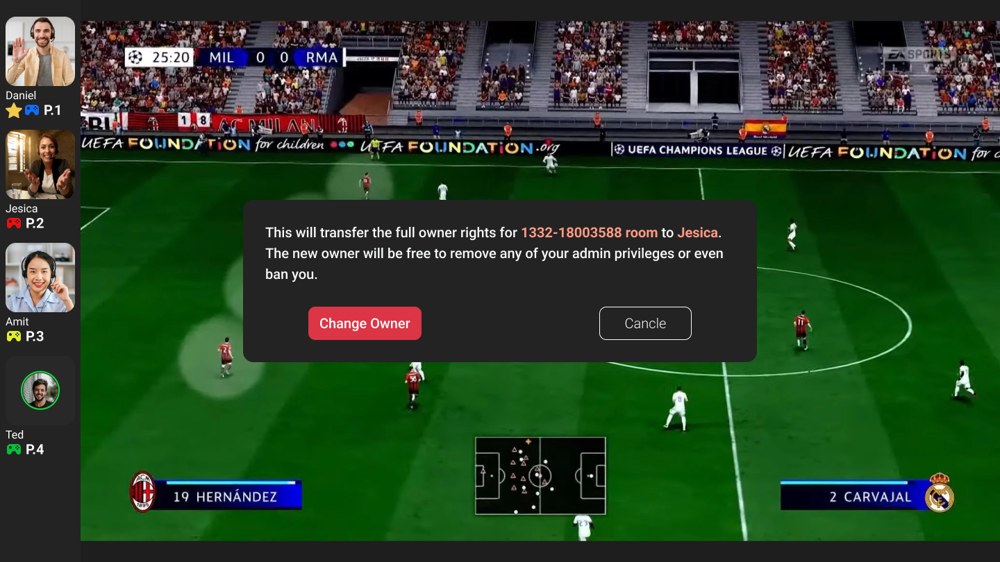
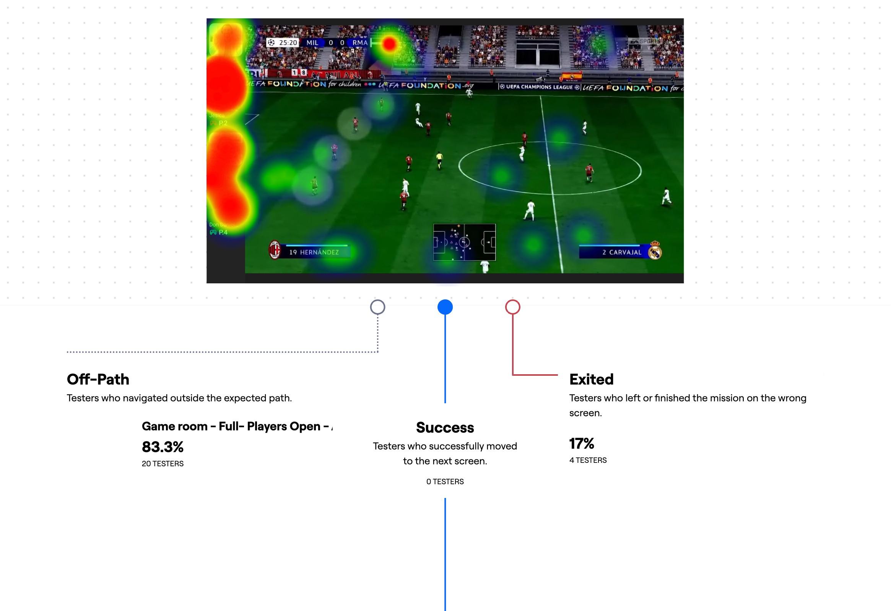
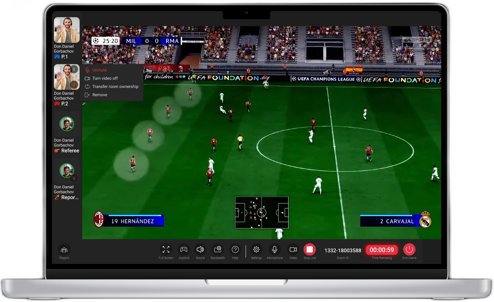
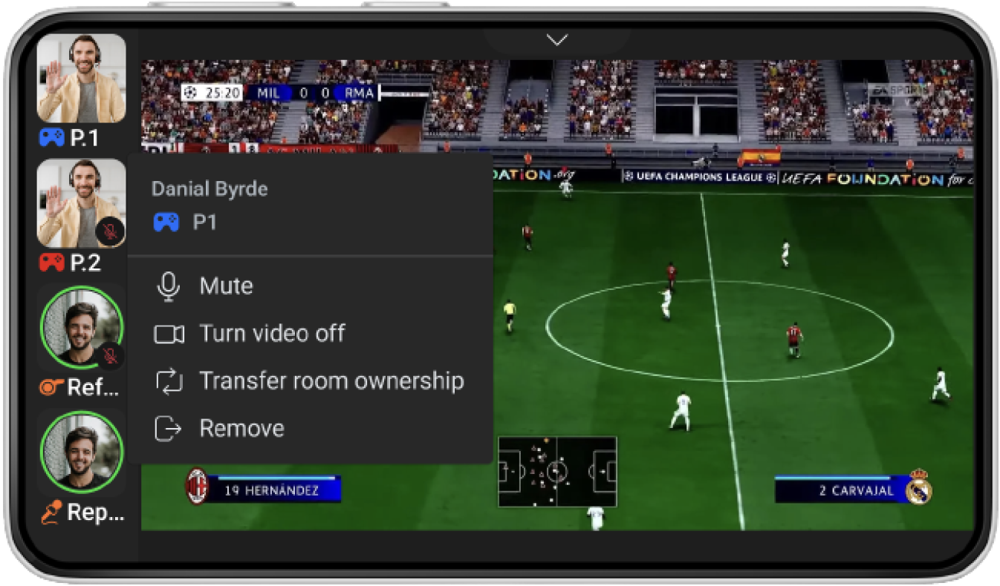

# From Hidden Right-Click to Visible Action

*Testing and revising ownership transfer in Arium's multiplayer Game Room*

A Game Room administrator needed to transfer ownership before leaving. My initial design supported the task through a right-click menu, but testing showed that people struggled to discover where to begin.

This case study shows how I tested the interaction with 24 participants, interpreted their paths, and revised the desktop and mobile designs with a visible menu trigger.

- **Product:** Arium cloud-gaming platform
- **My role:** UX/UI Designer
- **Scope:** Game Room ownership-transfer interaction
- **Methods:** User-story framing, rapid prototyping, Maze testing and responsive interaction design

## The Challenge

Arium's multiplayer Game Room brought participants and their controls alongside the game. The Product Owner asked me to add a way for the current administrator to pass ownership to another player before leaving.

My responsibility was this interaction, rather than the whole Game Room. I wrote the user story and “How might we” statement, created the low-fidelity prototype, prepared and ran the Maze test, analysed the results, and produced the revised designs.

I framed the request around a specific question: how could the administrator find the right participant and deliberately hand over their responsibilities and access?

This was more than changing a label beside someone's name. The confirmation I designed named the recipient, explained that they would receive owner rights, and offered a choice to confirm or cancel. Finding the action needed to be straightforward, while completing it needed to be intentional.

*The existing interface placed participant cards beside the game. In this early version, the cards had no visible menu trigger.*

## Testing the Interaction Before Polishing It

My initial flow placed “Transfer room ownership” inside a participant's context menu. An administrator would right-click the player's card, select the action, then confirm the transfer.

I initially assumed this approach would keep the busy Game Room interface uncluttered while grouping participant-management actions together. The trade-off was that someone had to discover the right-click interaction before they could see what was available.

I built a quick, low-fidelity version using the existing interface. Although the screens contained game imagery and familiar components, I was exploring the interaction rather than refining the final component design. I wanted to test the approach before spending more time on that detail.

*The initial design placed ownership transfer inside a menu reached through right-clicking a participant card.*

*The next step explained the change in rights and asked the administrator to confirm.*

## The Test Pointed Back to the First Action

I prepared a task-based Maze test with 24 participants. The task asked them to transfer ownership to player 2 using a PC.

The results needed a closer look than the headline alone:

- **0 direct successes**
- **20 indirect successes**
- **4 unfinished attempts**

Maze classified indirect successes as people who completed the task through unexpected paths. Most participants eventually completed the task, but none used the intended direct path. That suggested the problem was not whether the action existed—it was whether people could discover how to reach it.

*The full result: twenty participants completed through unexpected paths, and four did not finish.*

I reviewed the paths and heatmaps to understand where the difficulty was happening. My analysis pointed to the initial right-click action rather than the confirmation step. The mission also recorded a 64.3% misclick rate, giving me another reason to look beyond whether people eventually finished.

*The first-screen paths and click distribution helped me investigate how participants were trying to begin.*

The action was available, but the interface was asking people to find it without showing them how. That was the part I needed to revisit.

## Giving the Action a Visible Entry Point

I revised the desktop participant card by adding a visible ellipsis button that opened the menu. Ownership transfer stayed alongside the other participant actions, so I didn't need to expose the entire menu permanently.

The change addressed the problem at its entry point. Instead of relying only on a hidden interaction, the design now offered a control people could see. My aim was to make the action easier to find while keeping the interface compact.

*The desktop revision added a visible menu trigger to the participant card.*

I also produced the mobile design, adapting the participant menu to the landscape Game Room layout. The image below shows the open menu and its ownership-transfer action.

*The ownership-transfer action in the mobile landscape layout.*

## What I Took From It

Testing gave me a concrete reason to change the interaction before carrying the original pattern into the final designs. I could connect an observed difficulty to a specific design decision and revise that part of the flow.

The preserved work ends with the design revision, so I treat it as an evidence-informed response rather than a measured usability improvement. The next step would be to retest the visible trigger and compare completion paths with the original interaction.

The lesson I took from this was that a visually quiet interface can still make people work too hard. Testing early helped me see that before investing further in the components.

If I revisited the work today, I would also test the interaction across desktop and touch and include keyboard and accessibility checks.
