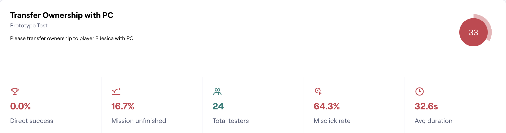
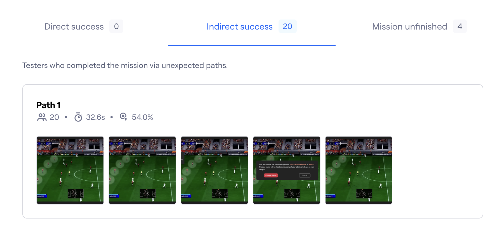
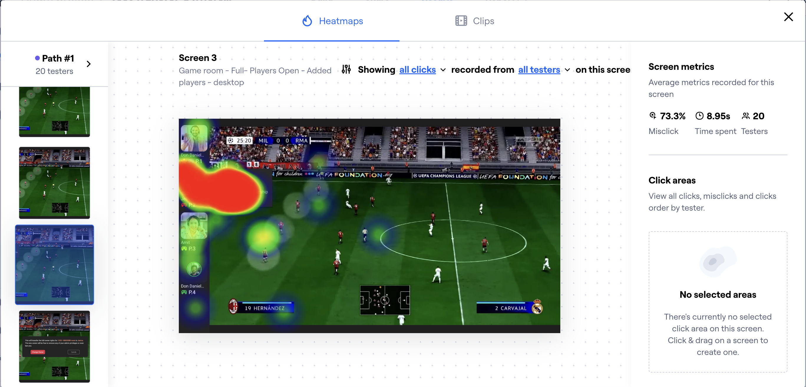

# From Hidden Right-Click to Visible Action

*Testing and revising ownership transfer in Arium's multiplayer Game Room*

A Game Room administrator needed to transfer ownership before leaving. My first design put the action inside a right-click menu—but testing showed that people struggled to discover where to begin.

I responded by adding a visible menu trigger to the participant card and carrying the interaction into the mobile design. The preserved work stops at that revision, so this is a story about using evidence to change a design direction, not a claim of measured improvement.

*Final design direction: the transfer action remains grouped with participant controls, but the menu now has a visible entry point.*

> **At a glance**
>
> - **Product:** Arium cloud-gaming platform
> - **My role:** UX/UI Designer
> - **Feature work:** 2023
> - **Scope:** Game Room ownership-transfer interaction
> - **My contribution:** Problem framing, rapid prototyping, Maze testing, analysis and responsive revision
> - **Evidence outcome:** The test exposed a hidden-action problem; the revised direction was not retested in the evidence I retained

## Ownership Transfer Had No Visible Starting Point

Arium's multiplayer Game Room placed participant controls beside the game. The Product Owner asked me to add a way for the current administrator to pass ownership to another player before leaving.

This was a focused interaction within an existing feature, rather than a redesign of the whole Game Room. I was responsible for framing and designing the transfer flow, testing it, interpreting the results, and revising the desktop and mobile designs.

*Before the revision, participant cards had no visible menu trigger.*

I framed the task around one question:

> **Design challenge**
>
> How could the administrator find the right participant and deliberately hand over their responsibilities and access?

The transfer also needed a deliberate confirmation. The design named the recipient, explained that they would receive owner rights, and let the administrator confirm or cancel. This reduced the chance of treating a meaningful permission change like an ordinary menu action.

## My First Design Kept the Interface Clean—but Hid the Action

My initial flow used a participant's context menu. The administrator would right-click the player's card, choose “Transfer room ownership,” and confirm the change.

I assumed this would keep the busy Game Room uncluttered while grouping participant-management actions together. The weakness in that assumption was simple: people had to know that the right-click menu existed before they could see any of those actions.

I built the interaction quickly using the existing interface. The screens included familiar components and realistic imagery, but my goal at this stage was to test the path before spending more time refining components.

*Step 1: right-clicking a participant card revealed the transfer action.*

*Step 2: the confirmation made the change explicit before transferring owner rights.*

## Testing Challenged My Right-Click Assumption

I prepared and ran a task-based Maze test with 24 participants. The task asked them to transfer ownership to player 2 using a PC.

*The mission overview showed zero direct success, a 64.3% misclick rate and an average duration of 32.6 seconds.*

The headline needed context:

> **Test result — 24 participants**
>
> - **0 direct successes**
> - **20 indirect successes**
> - **4 unfinished attempts**

Maze classified indirect successes as participants who completed the task through unexpected paths. Most people eventually finished, but nobody used the intended direct route. The result did not mean that the whole flow was unusable; it showed that the expected path was not clear.

*Twenty participants completed the task through unexpected paths, while four did not finish.*

I reviewed the paths and heatmaps to locate the difficulty. The first-screen evidence showed participants moving away from the intended route, while another preserved view showed activity concentrating around the participant menu once it was open. Together, these views pointed back to the first action: discovering the right-click entry point.

*The first-screen path report showed that participants were not beginning through the intended route.*

*Once the participant menu was visible, interaction concentrated around it. I treated this as supporting evidence rather than proof on its own.*

> **Key insight**
>
> The action was available, but the interface gave people no visible clue about how to reach it.

## A Visible Trigger Addressed the Failure Point

I added an ellipsis button to the desktop participant card. This gave the menu an explicit entry point while keeping ownership transfer grouped with the other participant actions.

The change responded directly to the test finding. It did not add the transfer action permanently to every card, and it no longer relied only on users knowing a desktop-specific right-click convention.

For the mobile landscape design, I carried the same participant menu and transfer action into the responsive Game Room layout.

*The mobile landscape direction carries the transfer action into the participant menu. This image shows the open state, not how the menu is triggered.*

## The Design Changed; Validation Remained Open

Testing gave me a concrete reason to revise the interaction before carrying the hidden-only pattern into the final designs. I could trace the change from an initial assumption, through observed behaviour, to a more explicit design direction.

> **Evidence boundary**
>
> I do not have a preserved retest of the revised interaction, so I present it as an evidence-informed revision—not a measured usability improvement.

This work changed how I think about visual simplicity. Removing visible controls can make an interface look quieter, but it can also make an important action harder to find. Testing the interaction early helped me see that trade-off before investing further in the components.

If I revisited the work today, I would retest the visible trigger against the original path, compare completion and error behaviour, and include touch, keyboard and accessibility checks.
